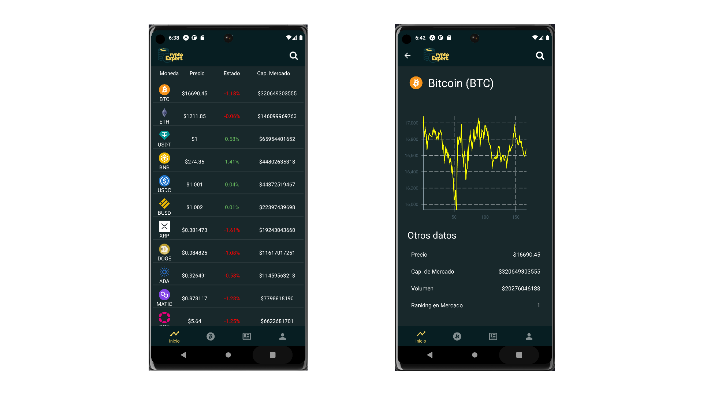

# Proyecto de Catedra CryptoExpert

## Integrantes 
José Daniel Martínez Ayala MM161916   
Mauricio Ernesto Velásquez Vega VV140557  
Cristian Odir López Revelo LR161911   
Jeffrey Steven Morán Martínez MM161923   

### DSE 02T CICLO02-2022

#### Mockups
- [Figma](https://www.figma.com/proto/utNslcQW3aVwSUk2pq6BYH/CryptoExpert?node-id=76%3A47&scaling=scale-down&page-id=0%3A1&starting-point-node-id=2%3A2)

# Capturas

## Detalles
Aplicación desarrollada en React Native con EXPO y probada en un emulador de Android Studio API 30

##### Versiones
EXPO ~46.0.16
React 18.0.0

Para probarlo se necesita tener la APP [EXPO](https://play.google.com/store/apps/details?id=host.exp.exponent) instalada en el celular o un emulador corriendo en Android Studio
~~~sh
yarn install
yarn android
~~~